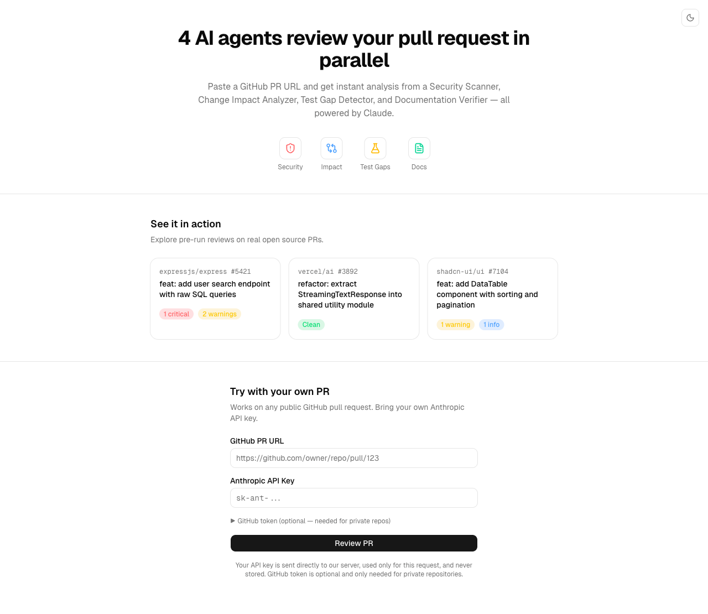
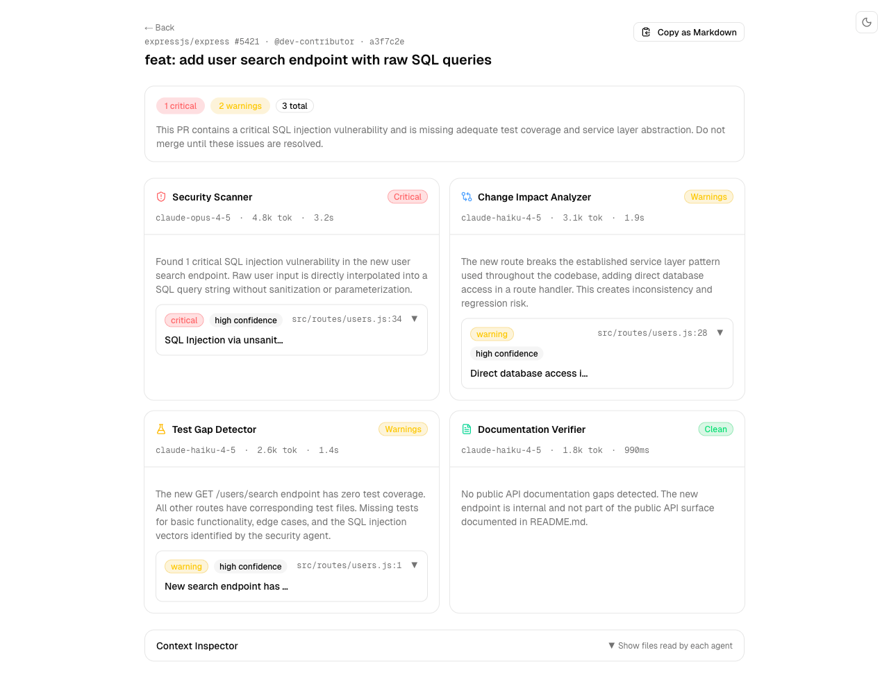
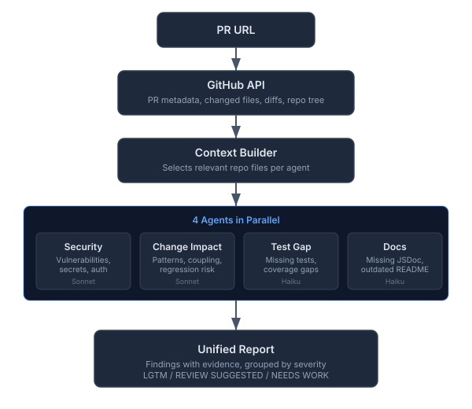

# Code Review Orchestrator

> Paste a GitHub PR URL. 4 AI agents review it in parallel. Get a unified report in seconds.

<p align="center">
  
</p>

You submit a pull request URL. The system fetches the diff, builds file-level context for each agent, and runs four specialized reviewers in parallel using Claude. In under 30 seconds you get a single report with every finding pinned to a specific file and line, backed by evidence from the code, with a concrete suggestion for how to fix it.

No vague "consider improving error handling." Every finding says exactly where, exactly what, and exactly how.

---

## The Agents

Each agent receives a tailored slice of the repository — not the entire codebase, but the files most relevant to its job. This keeps token usage efficient and findings precise.

| Agent | Model | What it reviews | Context it receives |
|-------|-------|-----------------|---------------------|
| **Security Scanner** | Claude Sonnet | Exposed secrets, missing auth checks, injection vectors, insecure dependencies | Config files, env examples, auth middleware, the diff |
| **Change Impact Analyzer** | Claude Sonnet | Separation of concerns violations, regression risk, deviations from repo patterns | Related modules, imports, existing architecture, the diff |
| **Test Gap Detector** | Claude Haiku | New code paths with no tests, edge cases missing from existing test suites | Existing test files, the diff, test config |
| **Documentation Verifier** | Claude Haiku | Undocumented public API, exported functions without JSDoc, outdated README | README, docs folder, public exports, the diff |

Sonnet handles the agents that need deeper reasoning (security, impact). Haiku handles the ones that are more pattern-matching (tests, docs). This balances cost and quality.

---

## What a Finding Looks Like

Every finding the agents return includes:

- **Severity** — `critical`, `warning`, or `info`
- **Confidence** — `high`, `medium`, or `low` (agents self-assess how certain they are)
- **File + line** — pinned to the exact location in the diff
- **Evidence** — a direct code quote showing the problem
- **Suggestion** — a concrete fix, not a generic recommendation

The report groups findings by agent and shows an overall assessment: **LGTM**, **REVIEW SUGGESTED**, or **NEEDS WORK**.

<p align="center">
  
</p>

---

## Try It — No API Key Needed

Three precomputed reviews load instantly from bundled JSON:

| Demo | What it shows |
|------|---------------|
| **Security Issues** | A PR that adds a raw SQL user search endpoint. The Security Scanner finds a critical SQL injection vulnerability and a hardcoded secret. The Change Impact Analyzer flags a missing auth check. |
| **Clean PR** | A well-structured refactor that extracts a shared utility module. All four agents return clean — no findings. |
| **Mixed** | A DataTable component PR with a warning about missing test coverage and an info-level note about undocumented props. Shows how findings from different agents are grouped together. |

Click any demo card on the home page to see the full report.

---

## How It Works

<p align="center">
  
</p>

1. **Parse & fetch** — The PR URL is validated with Zod, then Octokit fetches the diff, list of changed files, and a shallow tree of the repository.

2. **Build context** — For each agent, a context builder selects the most relevant existing files from the repo. The Security Scanner gets config files and auth middleware. The Test Gap Detector gets existing test files. This is how agents "understand" the codebase beyond just the diff.

3. **Run agents in parallel** — All four agents call Claude simultaneously via `Promise.allSettled`. Each agent has its own system prompt with structured output (Zod schema). If one agent fails or times out, the others still complete and their findings appear in the report.

4. **Unify & score** — Findings from all agents are aggregated. The system counts criticals, warnings, and info items, then generates a plain-English assessment. No numeric scores — just three states that map to the decision a reviewer actually needs to make: approve, comment, or request changes.

---

## Run Locally

```bash
git clone https://github.com/martin-minghetti/code-review-orchestrator.git
cd code-review-orchestrator
npm install
npm run dev
```

Open [http://localhost:3000](http://localhost:3000). The three demo reviews work immediately with no configuration.

**To review real PRs**, create a `.env.local` file:

```env
ANTHROPIC_API_KEY=sk-ant-...
GITHUB_TOKEN=ghp_...          # optional — for private repos or to avoid rate limits
```

Or use the web form directly — paste your Anthropic API key in the form field. The key is sent to the server, used once to call the Claude API, and discarded. It is never stored, logged, or cached. You can verify this in [`src/app/api/review/route.ts`](src/app/api/review/route.ts).

---

## Tech Stack

| Layer | Technology | Why |
|-------|-----------|-----|
| Framework | Next.js 16 (App Router) | Server components for the landing, client components for interactive report |
| AI | Vercel AI SDK v6 + `@ai-sdk/anthropic` | Structured output with Zod schemas, parallel agent execution |
| Models | Claude Sonnet (security, impact) · Claude Haiku (tests, docs) | Cost/quality balance — reasoning-heavy tasks get Sonnet |
| GitHub | Octokit v5 | Diff fetching, file content, repo tree traversal |
| UI | shadcn/ui + Tailwind CSS v4 | Dark/light theme, responsive layout |
| Validation | Zod v4 | Input validation, API response schemas, agent output schemas |
| Testing | Vitest + Testing Library (65 tests) | Unit tests for parsers, schemas, context builder, components |

---

## Design Decisions

**Why no AST parsing?**
The agents receive raw diffs and surrounding file context. Claude understands code structure well enough for the findings this tool targets — security issues, missing tests, undocumented APIs. AST parsing would add a native dependency (tree-sitter) and significant complexity without meaningfully improving output quality at this scope.

**Why `Promise.allSettled` instead of streaming per-finding?**
All four agents run in parallel and resolve together. The unified assessment at the top of the report depends on aggregate counts across all agents (e.g., "2 critical, 3 warnings"). Streaming individual findings would require either deferring the assessment or recomputing it as findings arrive. The current approach keeps the report renderer simple and the assessment accurate.

**Why no user accounts or login?**
The tool is stateless by design. Reviews are cached in-memory by `repo + PR number + commit SHA` for the lifetime of the server process. There's nothing to persist across sessions, and no reason to require an account to use a tool that calls an API you're already paying for.

**Why three assessment states instead of a numeric score?**
A score like "72/100" implies a precision that doesn't exist. The three states — LGTM / REVIEW SUGGESTED / NEEDS WORK — map directly to the three actions a code reviewer can take on a GitHub PR: approve, comment, or request changes. No ambiguity about what to do next.

**Why TypeScript/JavaScript only?**
The context builder fetches file content from the repo to give agents relevant background. Scoping to TS/JS files keeps context focused and token usage efficient. The agents themselves are language-agnostic in their prompts — adding more languages means extending the context builder to know which files matter for each language.

---

## License

MIT
